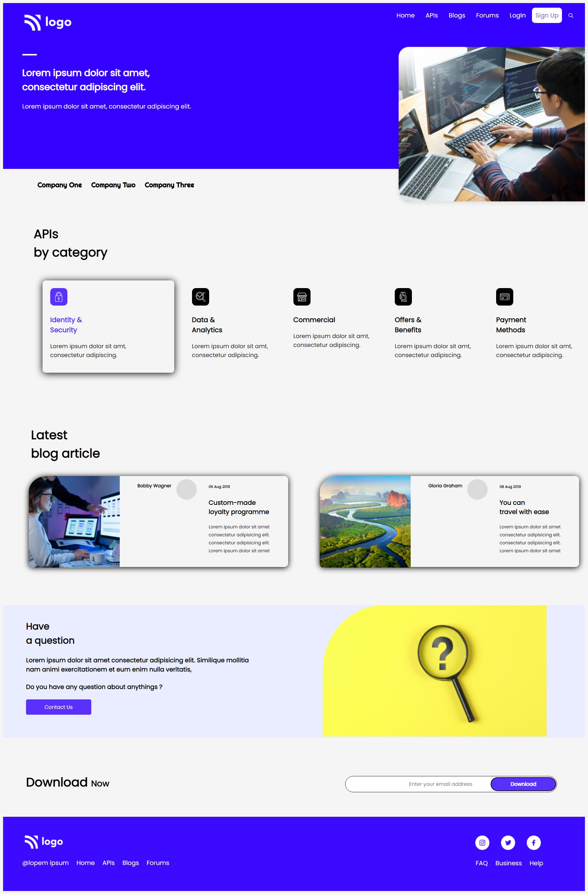

# ⭐ Project 9 : Developer Landing Page⭐

## 🔗Project 9 Link
https://htmlcssproject09.netlify.app/

This is a assignment given in **"JavaScript Full Stack Web Developer Bootcamp"** by **iNeuron**, built using **HTML5 and CSS3**.
 

 

## 📌 Tech Stack

&nbsp;
&nbsp;
 
 

## 📌 Overview

 

 "Template Screenshot")

## 📌 What I Learn

👉  Where to use Flexbox, Float and Grid  
👉  **CSS Pseudo Selectors**  
👉  Position in CSS  
👉  Designing Cards  
👉  Shadowing Effect with CSS  
👉  More on Border-radius  
👉  Designing Footer 
 

  

## Time taken to complete this project was **3 hr**.

## 📬 Connect With Me

- **LinkedIn** - [Pratyush Kesarwani](https://www.linkedin.com/in/pratyush-kesarwani-2b6601171/)

## 📌 Acknowledgments

- Course Instructor - [Hitesh Choudhary](https://github.com/hiteshchoudhary)
